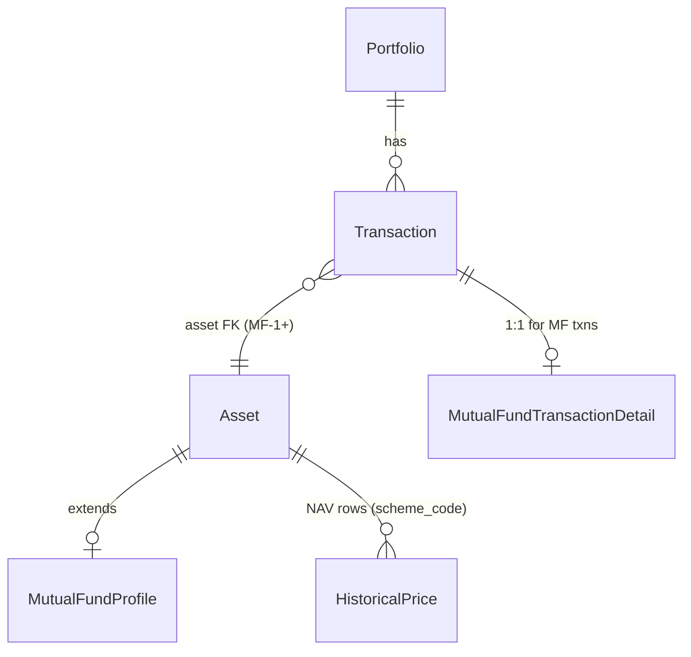

# Indian Mutual Funds — Design (MF-0)

**Status:** MF-1 schema through MF-10 live NAV provider implemented. Scheme search, CSV import, and polish remain MF-11+.

**Related docs:** [architecture.md](./architecture.md) · [database.md](./database.md) · [api-design.md](./api-design.md) · [current-state.md](./current-state.md) · [decisions.md](./decisions.md)

---

## Preservation rule (mandatory for MF-1+)

All implementation phases **must preserve** existing behavior for:

- Stock transactions, holdings, asset detail, CSV import, and stock splits
- FX rate lookup, conversion, and 7-day gap fill
- Benchmark index sync and performance overlay
- Portfolio summary, performance, and value-history APIs for stock-only portfolios
- Existing `/api/v1` contracts unless explicitly extended in a backward-compatible way

**Read-path rule:** Dashboard, holdings, summary, performance, and all other read APIs **must use cached DB data only**. They **must not** call external NAV or market-data APIs. NAV sync runs only via manual refresh, management commands, or (future) background scheduler — same pattern as stock `sync_prices`.

---

## Purpose and scope

KPulla6 today tracks **stocks** (and benchmark indices) with transactions as the source of truth and `HistoricalPrice` as the cached valuation input. This design adds **Indian mutual funds** as a distinct instrument type, identified by **AMFI `scheme_code`**, with folio-level granularity and NAV-based valuation.

### In scope (design)

- Target data model: `Asset`, `MutualFundProfile`, folio identity, mutual-fund transaction fields
- NAV cache strategy reusing or extending `HistoricalPrice`
- Incremental NAV sync via provider abstraction (AMFI)
- Holdings grouped by **scheme + folio** (MVP)
- Summary, performance, and display-currency impact
- Asset classification model (primary class, future exposure, future tax)
- NAV validation against cached data (warnings, not hard reject by default)
- Phased implementation plan MF-1 through MF-9

### Out of scope (this design phase)

- Runtime implementation (models, migrations, APIs, sync, frontend)
- Indian stocks / NSE-BSE instruments
- Automatic tax computation (LTCG/STCG, indexation)
- SIP automation, dividend reinvestment parsing, or corporate-action handling beyond BUY/SELL
- Background sync scheduler (already deferred globally)

---

## MVP scope and non-goals

### MVP (MF-1 … MF-8 target)

| Area | MVP behavior |
|------|----------------|
| Identifier | AMFI `scheme_code` (string, canonical); scheme name is display/search metadata only |
| Transaction types | `BUY`, `SELL` for mutual funds (no MF stock splits) |
| Required MF fields | Folio number, date of investment, NAV date, NAV, units allotted, market value, paid value |
| Valuation date | **NAV date** is primary for cost basis lots and historical valuation |
| Holdings key | `(scheme_code, folio_number)` within portfolio scope |
| NAV source | Cached in DB; incremental sync from AMFI provider |
| Read APIs | DB cache only; `nav_status` analogous to `price_status` |
| Classification | `primary_asset_class` on profile; hybrid **not** auto-mapped to equity |
| Grouping config | Scheme + folio only in MVP; scheme-only grouping deferred |

### Non-goals (explicit)

- Treating hybrid funds as 100% equity for allocation charts
- Using scheme name as a unique key or symbol substitute
- Live NAV fetch on dashboard or holdings page load
- CSV import for mutual funds in MVP (may follow in a later phase)
- Merging folios automatically across portfolios (folios are scoped per real portfolio via transactions)

---

## Target data model

High-level entity relationships:



Existing `Transaction` rows for stocks continue to use `asset_symbol` (uppercase ticker) without an `Asset` FK until a migration backfill strategy is chosen in MF-1. New mutual fund transactions **must** link to an `Asset` row with `asset_type=MUTUAL_FUND`.

---

## Asset model concept

Introduce a canonical **`Asset`** registry (planned table `assets`):

| Field | Purpose |
|-------|---------|
| `id` | PK |
| `asset_type` | `STOCK`, `MUTUAL_FUND`, … (extend `AssetType` enum) |
| `symbol` | Canonical identifier: uppercase ticker for stocks; **AMFI scheme_code** for mutual funds (e.g. `"120503"`) |
| `display_name` | Human label (scheme name for MFs; optional for stocks) |
| `currency` | Default quote currency (`INR` for Indian MFs) |
| `is_active` | Soft-disable mistaken schemes |
| `created_at` / `updated_at` | Audit |

**Rules:**

- `symbol` is unique per `asset_type` (or globally unique if simpler — decide in MF-1).
- Mutual fund `symbol` **must** be the AMFI `scheme_code`, never the scheme name.
- Stock flows may continue resolving by `Transaction.asset_symbol` during transition; MF flows require `Asset`.

---

## MutualFundProfile concept

One-to-one extension for `asset_type=MUTUAL_FUND` (planned table `mutual_fund_profiles`):

| Field | Purpose |
|-------|---------|
| `asset_id` | FK → `assets`, unique |
| `scheme_code` | Duplicate of `Asset.symbol` for clarity / AMFI joins |
| `scheme_name` | Display and search only; not unique |
| `fund_house` | AMC name (metadata) |
| `scheme_category` | AMFI category string (metadata) |
| `plan_type` | Direct / Regular / IDCW / Growth (metadata) |
| `primary_asset_class` | `EQUITY`, `DEBT`, `HYBRID`, `LIQUID`, `COMMODITY`, `OTHER` — see Classification |
| `isin` | Optional |
| `amfi_last_synced_at` | Profile metadata refresh timestamp |

Profile rows are populated/updated during NAV sync or scheme master import, not on every read.

---

## Folio model concept

A **folio** is not a separate persisted entity in MVP. Folio identity is carried on each mutual fund transaction:

| Concept | Storage |
|---------|---------|
| Folio number | Required string on `MutualFundTransactionDetail.folio_number` |
| Folio scope | Implicit: `(portfolio_id, scheme_code, folio_number)` from transaction FKs |
| Holdings group key | `(scheme_code, folio_number)` |

**Rationale:** Folio-level analytics and future tax calculation require stable folio attribution on every BUY/SELL. A dedicated `Folio` table (with AMC folio metadata) is optional in a later phase if folio-level settings are needed.

**Validation:** Empty or whitespace folio numbers are rejected on MF transaction write. Normalization: trim; case preserved (AMC folio formats vary).

---

## Mutual fund transaction detail strategy

Keep `Transaction` as the shared ledger row; add **`MutualFundTransactionDetail`** (planned, one-to-one, optional FK from `Transaction`):

| Field | Maps from user input | Notes |
|-------|----------------------|-------|
| `transaction_id` | — | One-to-one, `PROTECT` |
| `folio_number` | Folio Number | Required for MF |
| `investment_date` | Date of Investment | Cash-flow / reporting date |
| `nav_date` | NAV Date | **Primary valuation date** for FIFO lot dating |
| `nav` | NAV | Per-unit NAV at allotment |
| `units` | Units Allotted | Maps to `Transaction.quantity` (keep in sync) |
| `market_value` | Market Value | `units × nav` reference; stored for validation |
| `paid_value` | Paid Value | Actual amount paid (may differ from market value due to stamp duty, etc.) |
| `nav_validation_status` | — | `ok`, `warning`, `unchecked` (see NAV validation) |
| `nav_validation_message` | — | Human-readable mismatch detail |

**Transaction row mapping (MF BUY/SELL):**

| `Transaction` field | MF semantics |
|---------------------|--------------|
| `asset_symbol` | AMFI `scheme_code` (normalized string) |
| `date` | **`nav_date`** (canonical for finance layer lot ordering) |
| `type` | `BUY` / `SELL` |
| `quantity` | Units allotted / redeemed |
| `price_per_share` | NAV (per-unit); field name retained for schema compatibility |
| `currency` | `INR` (default for Indian MFs) |
| `fees` | Optional; stamp duty or exit load if captured separately |

**Finance adapter (MF-4+):** Map MF DTOs so FIFO uses `nav_date` as lot date and NAV as cost per unit. `investment_date` may be exposed for display and XIRR cash-flow timing — **decision required** (see Open questions).

**Stock transactions:** No `MutualFundTransactionDetail` row; behavior unchanged.

---

## NAV Date vs Date of Investment

| Date | Role |
|------|------|
| **NAV date** | Primary for valuation, historical price lookup, FIFO lot date, timeseries alignment |
| **Date of investment** | Operational / statement date; may differ when AMC allots units T+1 or on a non-NAV date |

When they differ:

- Cached NAV lookup uses **`nav_date`**
- Summary/performance daily buckets attribute quantity changes on **`nav_date`**
- UI shows both dates on MF transaction rows and asset detail

---

## NAV validation strategy

On MF transaction create/update, the backend compares user-entered NAV and market value against **cached** `HistoricalPrice` for `(scheme_code, nav_date)`:

| Check | Behavior |
|-------|----------|
| Cached NAV exists | Compare `\|entered_nav - cached_nav\| / cached_nav` to tolerance (e.g. 0.5% — configurable in MF-6) |
| Units × NAV vs market value | Compare to tolerance on absolute or relative basis |
| Cached NAV missing | `nav_validation_status=unchecked`; warning in API response; **do not block save** in MVP |
| Mismatch within tolerance | `ok` |
| Mismatch outside tolerance | `warning`; persist transaction; surface in `warnings[]` on holdings/asset detail |

**Never** call AMFI during validation — cache only. Sync may be suggested in warning text (“Run NAV sync”).

---

## NAV cache strategy

### Reuse `HistoricalPrice` (recommended for MVP)

Add `AssetType.MUTUAL_FUND` (or `MUTUAL_FUND_NAV`). Store NAV rows:

| Column | MF usage |
|--------|----------|
| `asset_symbol` | AMFI `scheme_code` |
| `date` | NAV date |
| `close_price` | NAV (semantic: net asset value per unit) |
| `currency` | `INR` |
| `asset_type` | `MUTUAL_FUND` |
| `source` | `amfi` |

**Read helpers:** `latest_nav(scheme_code)` mirrors `latest_historical_price` but filters `asset_type=MUTUAL_FUND`. Stock lookup must **exclude** MF rows (already filters `STOCK`).

### Alternative: asset-linked price table (future)

If `(asset_symbol, date)` uniqueness becomes insufficient (e.g. same code reused across types), migrate to `asset_id` FK on price rows. Not required for MVP if scheme codes remain unique and typed by `asset_type` filter.

---

## Required HistoricalPrice migration considerations

Current constraint: **unique `(asset_symbol, date)`** across all asset types ([database.md](./database.md)).

| Risk | Mitigation |
|------|------------|
| Symbol collision between stock ticker and scheme_code | Unlikely (AMFI codes are numeric strings); document ban on numeric-only stock symbols; filter by `asset_type` on all lookups |
| `close_price` name misleading for NAV | Accept in MVP; optional rename to `value` in a later cross-cutting migration |
| `AssetType` max_length | Ensure `MUTUAL_FUND` fits (`max_length=16` if needed) |
| Stock sync writing wrong type | MF sync uses separate upsert path with `asset_type=MUTUAL_FUND` |
| Unique constraint without `asset_type` | Safe if scheme_code namespace is disjoint; if not, MF-1 migration adds `(asset_symbol, date, asset_type)` unique — **decision in MF-1** |

No migration in MF-0.

---

## Mutual fund NAV provider abstraction

Mirror `market_data/providers/base.py` (`PriceProvider`):

```text
NavProvider (planned)
  fetch_nav_history(scheme_code, start_date, end_date) -> list[NavRow]
  fetch_scheme_master() -> list[SchemeInfo]   # optional periodic refresh
```

Implementations:

| Provider | Source | Notes |
|----------|--------|-------|
| `AmfiNavProvider` | MFAPI (`api.mfapi.in`) — live in MF-10; AMFI-sourced NAV data |
| `MockNavProvider` | Tests | No network |

Provider is injected in sync services and tests only — **never** in holdings/summary/performance views.

---

## Incremental NAV sync workflow

Follow the defensive pattern in `market_data/services/price_sync.py`:

1. Collect distinct `scheme_code` values from MF transactions (and registered `Asset` rows).
2. For each scheme, determine `start_date`:
   - If cached rows exist: `max(nav_date) + 1 day`
   - Else: `min(nav_date)` from MF transactions for that scheme
3. Fetch `[start_date, today]` from `NavProvider`.
4. Upsert idempotently into `HistoricalPrice` (`asset_type=MUTUAL_FUND`).
5. Log and continue on per-scheme failure (do not fail entire batch).
6. Optionally refresh `MutualFundProfile` metadata from scheme master (less frequent).

**Commands (planned):**

| Command | Purpose |
|---------|---------|
| `sync_mutual_fund_navs` | Incremental NAV sync |
| `sync_market_data` | Extend to include MF NAVs (flags: `--skip-mf`) |

**API (planned):** Extend `POST /api/v1/prices/refresh` or add `POST /api/v1/nav/refresh` with `{ "scheme_codes": [...] }` — intersect with portfolio schemes only.

---

## Holdings grouped by scheme + folio

MVP holding key: **`(scheme_code, folio_number)`** within resolved portfolio scope.

Planned holding payload extensions (backward compatible — new fields on MF rows only):

| Field | Notes |
|-------|-------|
| `asset_type` | `MUTUAL_FUND` |
| `scheme_code` | Same as `asset_symbol` for MFs |
| `scheme_name` | From profile |
| `folio_number` | Folio |
| `quantity` | Total units |
| `latest_nav` | From cache (not `latest_price`) |
| `nav_status` | `ok` \| `nav_missing` (parallel to `price_status`) |
| `avg_cost_per_unit` | FIFO on NAV |
| `primary_asset_class` | From profile |

Stock holdings: unchanged shape; no folio fields.

**FIFO:** Run per `(scheme_code, folio_number)` group, not per scheme alone.

**Asset detail route:** Extend to `GET /api/v1/portfolio/assets/{identifier}` where identifier is scheme_code; optional query `folio_number` for folio-scoped detail. Stock symbol route unchanged.

---

## Future grouping by scheme only

Add `AppSettings.mutual_fund_grouping` (or portfolio-level setting): `SCHEME_AND_FOLIO` (default) \| `SCHEME_ONLY`.

When `SCHEME_ONLY`:

- Aggregate quantities and FIFO across folios for the same scheme
- Folio breakdown available in drill-down / transaction list only
- Allocation charts use scheme-level totals

Implement in MF-9 or later; document now to avoid schema dead-ends (keep folio on transactions regardless).

---

## Summary / performance / value-history impact

Extend `build_portfolio_value_timeseries` and holdings aggregation to include MF positions:

| Concern | Approach |
|---------|----------|
| Daily valuation | Forward-fill NAV from `HistoricalPrice` (`MUTUAL_FUND`) on `nav_date` calendar |
| Mixed portfolio | Sum stock values (price × qty) + MF values (nav × units) in base currency |
| FX | MF INR → display currency via cached `FXRate` (same 7-day fill rules) |
| Missing NAV | `nav_missing` → value `0` for that holding on that day; warnings in response |
| XIRR | Include MF terminal values; cash-flow dates — align with investment_date vs nav_date decision |
| TWROR / cumulative return | No change to formulas; input series includes MF values |
| Benchmark overlay | Unaffected (indices remain `asset_type=INDEX`) |

**Critical:** Summary and performance code paths must branch on `asset_type` for lookup helper (`latest_historical_price` vs `latest_nav`) — never merge MF NAV into stock price queries.

---

## FX / display currency impact

Indian mutual funds are INR-denominated. When `display_currency` is `EUR`, `USD`, etc.:

- Convert MF holding values and timeseries points using cached INR→display FX (same as INR stock scenario)
- `fx_status` / warnings follow existing summary rules
- No special-case “MF exempt from FX”

When display currency is `INR`, MF amounts need no conversion if transaction currency is INR.

---

## Asset classification

### Primary asset class (MVP metadata)

Stored on `MutualFundProfile.primary_asset_class`:

| Value | Meaning |
|-------|---------|
| `EQUITY` | Equity-oriented schemes |
| `DEBT` | Debt / liquid / gilt |
| `HYBRID` | Balanced / aggressive hybrid — **not** treated as equity |
| `LIQUID` | Overnight / liquid funds |
| `COMMODITY` | Gold / silver funds of funds |
| `OTHER` | Unclassified |

Source: AMFI category mapping table in sync or manual seed — **not** inferred from scheme name alone.

### Future exposure model (not MVP)

Planned `mutual_fund_exposure` (or JSON field on profile):

| Field | Example |
|-------|---------|
| `equity_pct` | 65.0 |
| `debt_pct` | 30.0 |
| `other_pct` | 5.0 |
| `as_of_date` | Last factsheet date |

Used for allocation charts that need split exposure for hybrid funds without misclassifying as 100% equity.

### Future tax classification (not MVP)

Separate from `primary_asset_class`:

| Field | Purpose |
|-------|---------|
| `tax_category` | e.g. `EQUITY_ORIENTED`, `NON_EQUITY`, `UNKNOWN` |
| `eligible_112a` | Boolean for future LTCG on equity-oriented funds |

Tax rules change frequently; keep tax fields isolated from allocation `primary_asset_class`.

---

## Frontend impact

API-driven only ([frontend-design.md](./frontend-design.md)). **MF-8 implemented:**

| Surface | Change |
|---------|--------|
| **Transactions** | MF transaction form: manual `scheme_code` + `scheme_name`; folio, investment date, NAV date, NAV, units, market value, paid value |
| **Transactions list** | Badge/column for asset type; show folio for MF rows; calm `nav_verification_status` |
| **Assets / holdings** | MF rows show scheme name + folio; `price_status`/`latest_price` from cached NAV |
| **Asset detail** | Unchanged in MF-8 (stock tear-sheet preserved) |
| **Dashboard** | No new client math; mixed portfolio uses backend summary |
| **Settings** | Future: MF grouping mode |

Reuse `StatusBadge`, `WarningBanner`, `CurrencyValue`; add `nav_missing` alongside `price_missing` empty states.

**Deferred MF-11+:** scheme search autocomplete, MF CSV import, allocation redesign.

---

## Phased implementation plan

| Phase | Focus | Deliverables |
|-------|--------|--------------|
| **MF-0** | Design docs | This document; planned sections in database/api/current-state/changelog |
| **MF-1** | Schema | `Asset`, `MutualFundProfile`, `MutualFundTransactionDetail`; extend `AssetType`; migrations; model tests |
| **MF-2** | NAV cache + sync | `NavProvider`, `AmfiNavProvider`, `sync_mutual_fund_navs`, `latest_nav` lookup; sync tests (mocked) |
| **MF-3** | MF transaction API | POST/PUT/GET extensions; validation; folio required; scheme_code resolution; API tests |
| **MF-4** | Holdings + asset detail | Folio-scoped FIFO; `nav_status`; extend holdings/asset detail responses; preserve stock tests |
| **MF-5** | Summary + performance | Timeseries includes MF; mixed FX; regression tests for stock-only portfolios |
| **MF-6** | NAV validation | Tolerance checks vs cache; `nav_validation_status`; warnings |
| **MF-7** | Classification | `primary_asset_class` mapping from AMFI category; allocation breakdown by class |
| **MF-8** | Frontend | Transaction modal, holdings table, asset detail labels for MF |
| **MF-9** | NAV refresh API + combined sync | `POST /api/v1/nav/refresh`; `sync_market_data` / `force-sync` include MF NAVs |
| **MF-10** | Live NAV provider | MFAPI-backed `AmfiNavProvider`; parser + mocked HTTP tests |
| **MF-11** | Polish + config | Scheme-only grouping setting; CSV import (if approved); exposure model prep |

Each phase: tests first where practical, `make test`, update docs/changelog, smallest safe diff.

---

## Risks and mitigations

| Risk | Mitigation |
|------|------------|
| Breaking stock holdings/tests | Separate code paths by `asset_type`; run full regression suite each phase |
| scheme_code / ticker collision | Type-filtered lookups; numeric scheme codes vs stock tickers |
| AMFI download format changes | Provider abstraction; defensive parsing; logged failures |
| User-entered NAV wrong | Validation warnings vs cache; never silent overwrite of user data |
| Hybrid misallocation | Explicit `HYBRID` class; exposure model later |
| FIFO across folios | Never merge folios in MVP aggregation |
| Unique constraint on prices | Evaluate `(symbol, date, asset_type)` in MF-1 if needed |
| investment_date vs nav_date for XIRR | Decide explicitly before MF-5 |

---

## Open questions / decisions

| # | Question | Options | Recommendation |
|---|----------|---------|----------------|
| 1 | XIRR cash-flow date for MF | `investment_date` vs `nav_date` | `investment_date` for cash flow, `nav_date` for valuation — document in MF-5 |
| 2 | `Transaction.date` for MF | Always `nav_date` | Yes — keeps finance sort order consistent |
| 3 | Unique on `HistoricalPrice` | `(symbol, date)` vs include `asset_type` | Include `asset_type` if any collision risk |
| 4 | NAV refresh endpoint | Extend `/prices/refresh` vs new `/nav/refresh` | Extend with type param or separate route for clarity |
| 5 | Scheme master storage | Full AMFI master table vs profile on demand | Lazy profile create on first txn + sync refresh |
| 6 | SELL partial units | Standard FIFO per folio | Same as stock FIFO within folio |
| 7 | `paid_value` vs `market_value` for cost basis | Paid value includes charges | Use **paid_value** for invested amount; NAV × units for market reference |
| 8 | CSV import for MF | Phase MF-9 or later | Defer; manual form first |

Record decisions in [decisions.md](./decisions.md) as they are resolved during MF-1+.

---

## References

- AMFI scheme code and NAV archives: [https://www.amfiindia.com](https://www.amfiindia.com)
- Existing sync pattern: `backend/market_data/services/price_sync.py`
- Existing holdings: `backend/portfolios/holdings_service.py`
- AGENTS.md: transactions source of truth; no live external calls on dashboard reads
