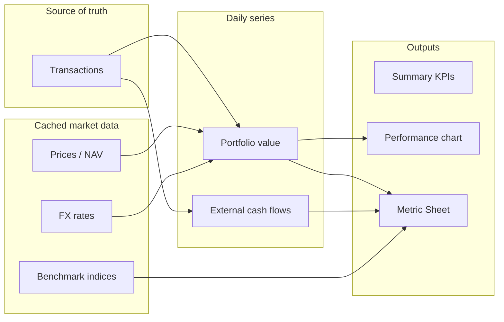

# Portfolio analytics overview

Portfolio Insight (KPulla6) answers three related questions:

1. **What do I own, and what is it worth?** — holdings, FIFO cost basis, cached prices/NAV, display currency.
2. **How has wealth changed over time?** — daily value series, performance chart, money-weighted and time-weighted returns.
3. **How good was that path relative to risk and a benchmark?** — Metric Sheet (volatility, drawdown, Sharpe, beta, etc.).

This chapter orients you before diving into individual metrics.

## Subjects (what you can analyze)

| Subject | API | Typical use |
|---------|-----|-------------|
| **Portfolio** | `GET /api/v1/analytics/performance-metrics` | Whole book or one real portfolio; virtual **All Portfolios** aggregates active portfolios in display currency |
| **Asset** | `GET /api/v1/analytics/assets/{symbol}/performance-metrics` | One stock symbol or MF scheme (folio required when multiple folios exist) |
| **Compare** | `GET /api/v1/analytics/compare?subjects=asset:A,asset:B` | Two assets on **common overlapping dates** only (MVP) |

Transactions are always the **source of truth**. Analytics read **cached** stock prices, index levels, FX rates, and MF NAVs — never live market feeds on dashboard load.

## Two layers of “performance”

### Summary & chart (`/portfolio/summary`, `/portfolio/performance`)

- **Value** — end-of-day portfolio value in display currency.
- **Cumulative return (chart)** — money-weighted: \((V + \text{withdrawals} - \text{contributions}) / \text{contributions} - 1\).
- **TWROR (chart)** — chain-linked daily returns that **ignore** the size of your deposits (manager-style path).
- **XIRR (summary)** — internal rate of return on BUY/SELL cash flows plus terminal value; **full history**, not range-sliced.

### Metric Sheet (`/analytics/*`)

Uses the same value/flow machinery but adds:

- Risk and drawdown from **daily TWROR-style returns** (cash-flow-adjusted).
- Headline **cumulative return / CAGR** aligned with the chart’s **money-weighted** formula for the selected **range**.
- Optional **benchmark** block (beta, alpha, etc.) from aligned daily index returns.
- **Periodic returns** (monthly grid, calendar-year bars) and **drawdown** tables/charts.

See [04 — Return metrics](./04-return-metrics.md) for why headline return and TWROR can differ when you add or withdraw cash.

## Range vs full scope

| Control | Effect |
|---------|--------|
| `range` (`7D` … `ALL`) | Slices value/flow series from range start; recomputes most Metric Sheet stats on that window |
| **XIRR** | Always **full scope** (`xirr_scope: "full_scope"`) — inception through today |
| **Compare** | Metrics computed only on **dates where both assets have returns**; warning when overlap is thin |

Non-`ALL` ranges use a **bootstrap** at range start (opening holdings and prices) so the window does not inherit pre-range history in the daily return chain — matching the performance API.

## Return conventions in API and UI

- Backend sends **fractions** (`0.10` = 10%).
- Frontend `metricFormatters.js` multiplies by 100 for display.
- Ratios (Sharpe, beta) show as plain numbers with modest decimal places.
- `null` / missing data → em dash (`—`) and optional **warnings** (missing prices, stale NAV, FX gaps, split-adjusted price suspicion, thin benchmark overlap).

## Institutional vs personal investor lens

**Institutions** report to clients and regulators using audited NAV, GIPS-style time-weighted returns for manager skill, and money-weighted returns for client experience. They pair return with **volatility, drawdown, and benchmark-relative** stats.

**Serious personal investors** care about the same split: “Did **I** make money?” (money-weighted / XIRR) vs “Did **my decisions** work per unit of risk?” (TWROR path + risk metrics). **Value investors** add business-quality metrics (ROE, moat, margin of safety) that live **outside** this app's Metric Sheet today — see [03 — Legendary investor metrics](./03-legendary-investor-metrics.md).

## Where to go next

- Fund and allocator vocabulary: [02 — Institutional fund metrics](./02-institutional-fund-metrics.md)
- Each implemented Metric Sheet field: [04](./04-return-metrics.md)–[08](./08-benchmark-and-relative-performance.md)
- Code and API keys: [12 — Metric implementation notes](./12-metric-implementation-notes.md)
