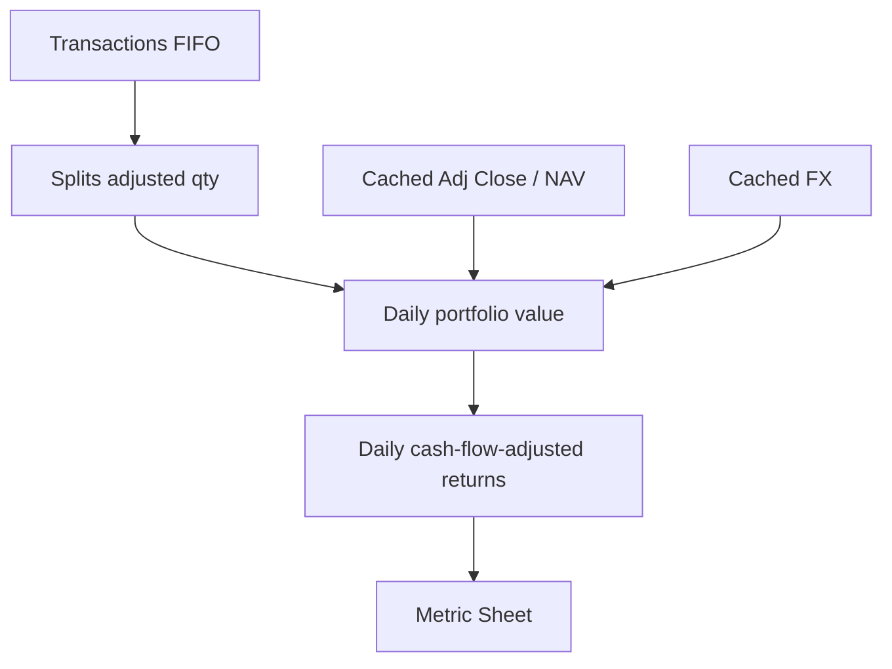

# Portfolio construction

**Portfolio construction** is how you choose weights, rebalance, and fund positions over time. Portfolio Insight does not (yet) optimize portfolios — it **measures** the portfolio implied by your **transactions** and cached market data.

This chapter links construction concepts to what KPulla6 can observe.

## What “the portfolio” means in KPulla6

| Concept | Source |
|---------|--------|
| Holdings & weights | Derived from FIFO lots + latest price/NAV |
| Cash flows | BUY/SELL (and MF paid/market value rules) |
| Corporate actions | `STOCK_SPLIT` rows; quantities adjusted for analytics |
| Scope | One real portfolio, or virtual **All Portfolios** (aggregated in display currency) |
| Display currency | Settings `display_currency`; FX from cache with 7-day fill on reads |

Transactions are **immutable truth** for quantity and cost; prices/NAV are **cached observations** for mark-to-market.

## Construction inputs you control (outside the app)

| Decision | Analytics impact |
|----------|------------------|
| Position sizing | Concentration on Assets allocation chart |
| Timing of contributions | XIRR vs TWROR divergence |
| Rebalancing frequency | Turnover (not computed) — flow pattern in transactions |
| Asset class mix | MF `primary_asset_class`; stocks by symbol |
| Currency mix | FX conversion on summary / all-scope aggregation |
| Benchmark choice | Relative metrics in Metric Sheet |

## How holdings feed performance

1. **Build lots** — `build_split_adjusted_lot_snapshots` for value history.  
2. **Mark to market** — forward-filled prices; MF NAV with staleness warnings (>5 calendar days).  
3. **External flows** — per-portfolio flows converted to display currency on all-scope.  
4. **Returns** — `daily_returns_from_values` → risk, drawdown, periodic, benchmark alignment.

## Institutional construction practices (context)

| Practice | KPulla6 reflection |
|----------|-------------------|
| Strategic asset allocation | Not modeled — you see **outcome** weights, not policy bands |
| Rebalance to target | Manual via transactions only |
| Risk parity | **Planned** — no risk contribution math |
| Tax-loss harvesting | Realized P/L visible; no harvest optimizer |
| Capacity / liquidity | Warnings on missing prices/NAV; no ADV metrics |

## Value-investor construction practices (context)

| Practice | KPulla6 reflection |
|----------|-------------------|
| Concentrated high-conviction | Allocation % shows weight; no “conviction score” |
| Long holding periods | Transaction history + full-scope XIRR |
| Margin of safety at purchase | Cost basis vs price — not intrinsic value |
| Avoid excessive turnover | **Planned** — turnover metric |

## Multi-portfolio construction

- Up to **5 active** real portfolios + Default.  
- **All Portfolios** sums headline monetary fields per portfolio after FX conversion (FIX-2 pattern).  
- XIRR on all-scope merges cash flows across portfolios.  
- Metric Sheet all-scope uses aggregated display-currency value/flow series.

## Mutual funds vs stocks

| Aspect | Stocks | Mutual funds |
|--------|--------|----------------|
| Identifier | Symbol | AMFI scheme code |
| Valuation | Adj Close (split-adjusted) | Cached NAV |
| Folio | N/A | Required when multiple folios |
| Cash flows | BUY/SELL + fees | `investment_date`, `paid_value`, units |
| Classification | Asset type | `primary_asset_class` inference |

## Data quality as a construction constraint

Bad construction measurement happens with bad inputs:

- **Raw pre-split stock prices** → false spikes (split warnings).  
- **Missing NAV/FX** → `null` values and warnings.  
- **Oversold** positions → realized P/L quirks; warnings, not hard block.

Run `make refresh` before trusting Metric Sheet after imports.

## Planned / not yet implemented

| Feature | Status |
|---------|--------|
| Target allocation vs actual | **Planned** |
| Rebalance suggestions | **Planned** |
| Portfolio turnover | **Planned** |
| Tax-lot optimization | **Planned** |
| Scenario / Monte Carlo | **Planned** |

## Related docs

- [10 — Asset allocation and diversification](./10-asset-allocation-and-diversification.md)
- [12 — Metric implementation notes](./12-metric-implementation-notes.md)
- [mutual-funds.md](../mutual-funds.md)
